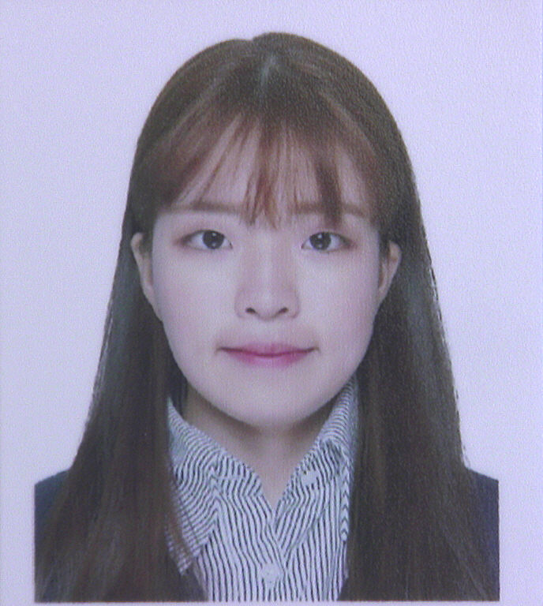
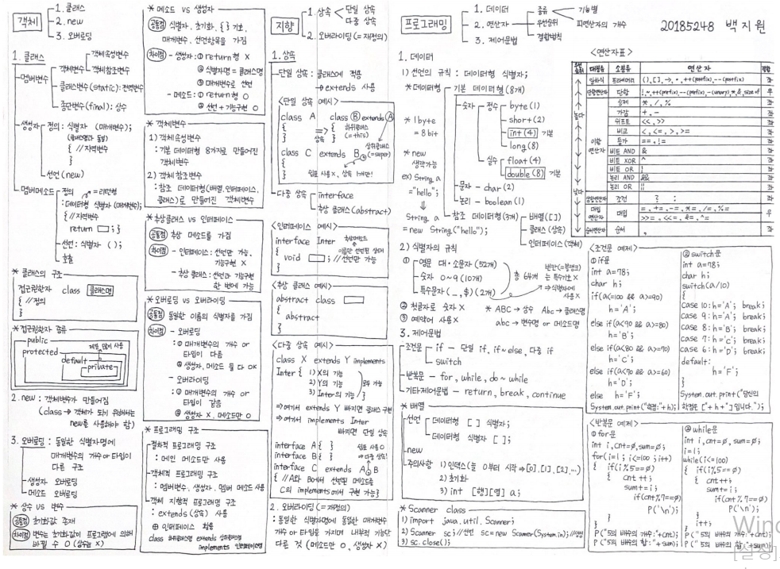
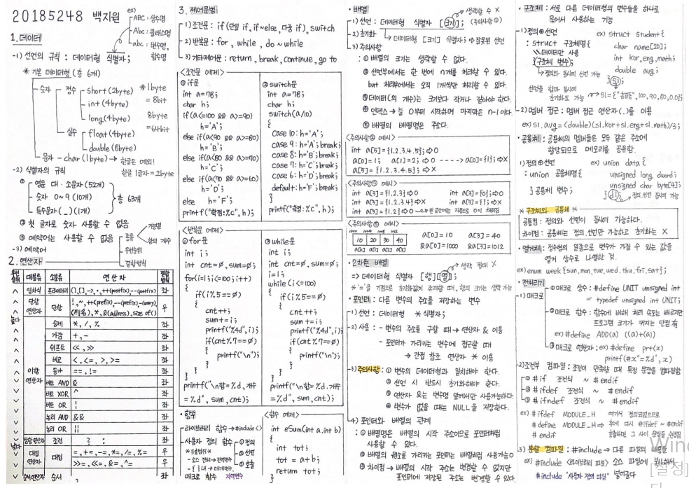

# 지원자 백지원 이력서입니다.

## 백지원
### 1999년 (만 20세)  |   여
#### baeg1611@naver.com
---
## 학력
| 재학기간 | 구분 | 학교명(소재지) | 전공 | 학점 |
|----------|----------|----------|----------|----------|
| 2018.02 ~ 2020.11 | 재학중 | 한림대학교(춘천)(강원) | 스마트IoT학과 | 3.74 / 4.5 |
| 2015.02 ~ 2018.02 | 졸업 | 한성여자고등학교(서울) | 이과계열 | . |
---
## 대외활동
| 기간 | 구분 | 기관/장소 | 내용 |
|----------|----------|----------|----------|
| 2018.03 ~ 2018.12 | 교내활동 | 한림대학교 공과대학 | 단과대 학생회에서 기획부원으로서 진로, 취업 관련 사업 진행을 담당하였습니다.
---
## 자격증/어학/수상내역
| 취득일/수상일 | 구분 | 자격/어학/수상명 | 발행처/기관/언어 | 합격/점수 |
|----------|----------|----------|----------|----------|
| 2018.02 | 어학시험 | 교내 TOEIC | 국제교육부 | 540 |
---
## 사용 가능한 프로그래밍 툴
1. java script
```java script
<html>
 <head> <title> 치매 예방을 위한 두뇌 활성화 프로그램 </title> </head>
  <body>
   <script type = "text/javascript">

	var res=""
	var data=[], inf=["이름","나이","연락처"]
	var rcv=[], asw=[11,7,5,4,77,45,-2,28.5,504,97]
	var sig=["◐+♣","▲-☆","◑♥/▲","♧*◐/♡","△★+★△","♣*♣-◑△","◐+♧*☆-♡","♥★/△+◐☆","▲◐*(♧-★)","(♥-△)*(☆-♡)+♣◑"]

	
	function Welcome()
	{
		alert("치매 예방을 위한 두뇌 활성화 프로그램을 방문해주신 여러분들을 환영합니다. \n원활한 프로그램 진행을 위해 개인정보를 입력해주시길 바랍니다. \n개인정보는 프로그램이 끝나는 즉시 파기됩니다.");
	}

	function dataInput()
	{
		for( i=0 ; i<3 ; i++ )
			data[i] = prompt(inf[i] + "(을)를 입력하세요: ","")
	}

	function Explain()
	{
		alert("아래와 같이 총 10개의 기호는 각각 0~9까지의 숫자를 나타냅니다. \n\n☆=0,★=1,◐=2,◑=3,♡=4,♥=5,△=6,▲=7,♧=8,♣=9 \n\n 잘 보셨나요?");

		alert("지금부터 앞서 기호들을 사용한 사칙연산 문제들이 나옵니다. \n식의 정답을 맞혀주세요!");
	}

	function Question()
	{
		for( i=0 ; i<10 ; i++ )
		{
			rcv[i]=eval(prompt(sig[i],""))
			res += sig[i] + "=" + rcv[i] + "\n" ;
		}
		res += "입력하신 데이터가 맞습니까? \n";
		res = confirm(res);
	}

	function lastCheck()
	{
		if(res == true)
		{
			for( i=0 ; i<10 ; i++ )
			{
				if(rcv[i]==asw[i])
					document.write("문제 "+(i+1)+"번 : O "+"<br>");
				else
					document.write("문제 "+(i+1)+"번 : X "+"<br>");
			}
			document.write("<br><br>수고하셨습니다:D");
		}
		else
			document.write("다시 입력하세요.");		
	}


	Welcome()
	dataInput()
	Explain()
	Question()
	lastCheck()

	
   </script>
  </body>
</html>
```
2. java

##### 원맵을 통해 기본개념을 정리하고 공부했으며 기본 문법,메소드, 클래스 등 사용에 있어 문제 없습니다.


3. C

##### 원맵을 통해 기본개념을 정리하고 공부했으며 기본 문법 사용, 포인터 등 사용에 있어 문제 없습니다.


4. C++
5. Python

##### 기본 문법, 터틀 등 사용에 있어 문제 없으며 현재 텍스트 정보 처리 기능에 대해 공부하고 있습니다.
---
## 자기소개서
 - 현재 중국학과를 복수전공 하고 있으며 중국어 기본 회화 능력을 갖추고 있습니다. HSK 5급과 TOEIC 공부를 학기 중에도 꾸준히 하고 있으며 정보처리기사 자격증을 준비하고 있습니다.
 - 중,고등학교에 이어 대학교에서도 학생회로 활동한 적이 있습니다. 저를 비롯한 여러 학우들이 복수전공과 진로 설정에 대해 어려움을 느낀다고 생각하여 교내 취업진로지원센터와 연계한 다양한 특강들을 성공적으로 진행한 경험이 있습니다. 이런 경험들을 통해 타인과의 소통 능력과 추진력, 맡은 바에 대한 책임감을 기를 수 있었습니다.
 - 학창시절에 단 한 번도 지각과 결석을 한 적이 없으며 이에 개근상을 놓친 적이 없습니다. 또한 패밀리레스토랑에서 약 3년 동안 근무하는 동안 무단 결근, 지각을 한 적이 없어 매장 내에서 성실한 근무자로 인정 받아 성과금을 여러 차례 받은 적 있습니다.
 - 위와 같은 역량들을 바탕으로 회사의 발전에 기여할 수 있는 인재가 되도록 노력하겠습니다.